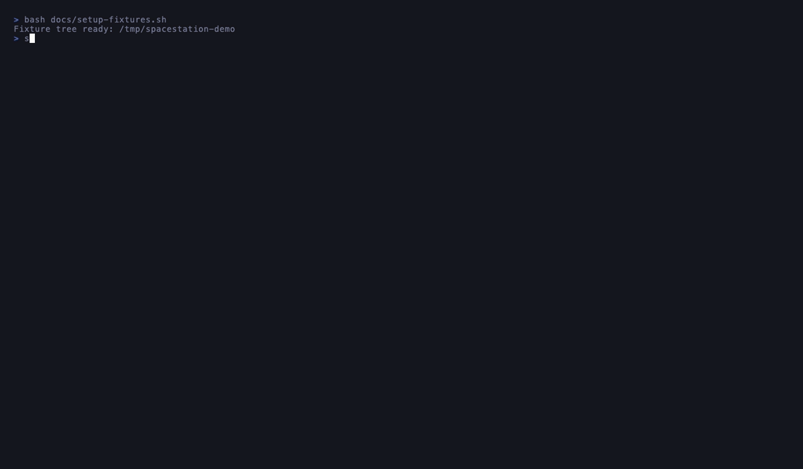

# spacestation

[](https://github.com/erick303/spacestation/actions/workflows/ci.yml)
[](https://goreportcard.com/report/github.com/erick303/spacestation)
[](LICENSE)

A developer-aware disk cleanup tool for macOS. Single Go binary, terminal UI, knows how each ecosystem cleans itself up.



> Regenerate this demo with `vhs docs/demo.tape`.

```
spacestation ──────────────────────────────────────  42.1 GB reclaimable
                                                    8 of 31 selected

  ▼ Node.js  (38.6 GB, 86 items, 2 selected)
    [x] ⚡ npm: cache clean                              16.88 GB   2d ago
    [x] ⚡ pnpm: prune unreferenced (keeps installs fast) 3.95 GB   1d ago
    [ ]    ~/projects/<repo>/api/node_modules               2.10 GB  89d ago
    …
  ▼ Docker  (10.9 GB, 1 item)
    [x] ⚡ docker: prune unused images / volumes / build  10.89 GB   now
  ▼ Go Cache  (8.2 GB, 2 items)
    [x] ⚡ go: clean module download cache (-modcache)     7.19 GB   3d ago
    [ ] ⚡ go: clean build cache (-cache)                  1.04 GB   12h ago
  ▼ Xcode   (8.6 GB, 3 items) ▶ Python (6.4 GB) ▶ Homebrew (1.2 GB) …

  ⚡ npm cache clean --force
  ~/.npm/_cacache
  regenerable • Stale 2d, regenerable

  space toggle  a select-group  A select-all  c clear
  tab collapse  enter clean  r rescan  q quit
```

`⚡` marks "smart" candidates — instead of `rm -rf`-ing the cache directory,
spacestation runs the ecosystem's own cleanup command, which is usually faster,
safer, and (for tools like `pnpm store prune`) reclaims most of the space
without slowing down your next install.

## Why

A developer Mac fills up with regenerable junk: `node_modules`, `.next`, `target`,
`.venv`, Xcode `DerivedData`, Docker disk images, `~/Library/Caches/*`,
language module caches. Manually hunting them is tedious; `rm -rf`-ing them is
risky (deleting Docker's VM disk wipes every image and volume you have).

spacestation does two things well:

1. **Finds the right things fast.** Parallel pattern-walk over your project
   roots that prunes at every known artifact dir (it never descends into
   `node_modules` looking for nested junk), plus targeted probes for the big
   known caches. A persistent size cache means the second scan onward is
   ~5× faster than the first.

2. **Cleans them the right way.** For each supported ecosystem it emits a
   command-based candidate that invokes the tool's own cleanup, instead of
   blindly deleting the cache directory.

## Install

Requires Go 1.25+ and macOS (Apple Silicon or Intel).

```sh
go install github.com/erick303/spacestation@latest
```

Now `spacestation` is on your `$PATH` (assuming `~/go/bin` is in it).

To build from a checkout instead:

```sh
git clone https://github.com/erick303/spacestation
cd spacestation
go install .
```

## Use

```sh
spacestation              # launches the TUI
spacestation --json --dry-run | jq    # see what would be selected, no UI
spacestation --config     # print config-file path
spacestation --version    # print version and exit
```

Keys inside the TUI:

| key            | action                                       |
|----------------|----------------------------------------------|
| ↑/↓, j/k       | move cursor                                  |
| g / G          | jump to top / bottom (also home / end)       |
| [ / ]          | jump to previous / next group header         |
| pgup / pgdn    | page up / down                               |
| space          | toggle current item (or whole group on a header — two-press) |
| a / u          | select / unselect all items in current group |
| A              | select all                                   |
| c              | clear all (two-press to confirm)             |
| tab            | collapse / expand group at cursor            |
| enter          | open confirmation, then clean (move to Trash) |
| x              | permanent Trash action — remove checked Trash items, or empty the whole Trash if none checked |
| v              | toggle the disk-usage dashboard              |
| r              | rescan                                       |
| ?              | show / hide the keybindings help overlay     |
| q / ctrl+c     | quit                                         |

## What it knows about

### Smart cleanups (action ⚡)

When the tool is on `$PATH`, spacestation asks it how much space it can free
and emits a single "run this command" candidate instead of nuking the dir.

| Ecosystem        | Command                                  | What it does |
|------------------|------------------------------------------|--------------|
| Docker           | `docker system prune -a --volumes -f`    | Removes unused images, stopped containers, unused volumes, build cache. Size is reported by `docker system df`. |
| Homebrew         | `brew cleanup -s --prune=all`            | Removes old keg versions + downloads. Size from `brew cleanup --dry-run`. |
| Go (modcache)    | `go clean -modcache`                     | Removes `~/go/pkg/mod`. Re-downloaded by `go mod download`. |
| Go (build cache) | `go clean -cache`                        | Removes `~/Library/Caches/go-build`. |
| npm              | `npm cache clean --force`                | Empties `~/.npm/_cacache`. |
| yarn             | `yarn cache clean`                       | Empties `~/.yarn/cache`. |
| **pnpm**         | `pnpm store prune`                       | **Removes only *unreferenced* packages** — your active installs stay fast. |
| Cargo            | `cargo cache --autoclean`                | Stale registry sources + git checkouts. Requires `cargo-cache` crate. |
| uv (Python)      | `uv cache clean`                         | Empties uv's package cache. |
| pip (Python)     | `pip cache purge` (or `pip3`)            | Empties pip's wheel cache. |
| Xcode simulators | `xcrun simctl delete unavailable`        | Removes simulator devices whose runtimes are no longer installed. Needs full Xcode.app, not just Command Line Tools. |

If a tool isn't on `$PATH`, the corresponding smart probe stays silent and
the regular path-based candidate is used instead.

### Path-based candidates (action: delete)

Discovered by walking your configured project roots (auto-detected on first
run from common dev-folder locations; see `project_roots` in [Config](#config)):

`node_modules`, `.pnpm-store`, `.next`, `.nuxt`, `.turbo`, `.vite`,
`.parcel-cache`, `dist`, `out`, `.venv`, `venv`, `.virtualenv`, `__pycache__`,
`.pytest_cache`, `.mypy_cache`, `.ruff_cache`, `.tox`, `target` (Rust/Maven),
`.gradle`, `build`, `DerivedData`.

Plus fixed-path probes for: `~/Library/Developer/Xcode/{DerivedData,Archives}`,
`~/Library/Containers/com.docker.docker/Data/vms` (only if Docker not installed),
`~/Library/Group Containers/group.com.docker`, `~/Library/Caches/*` per-app,
`~/.cache/*`, `~/.cargo/{registry,git}`, `~/Downloads` (>90d, >100MB), `~/.Trash`.

Plus macOS **screenshots** (`Screenshot *.png` and other `screencapture` formats)
in the configured screenshot location — read from
`com.apple.screencapture location`, defaulting to `~/Desktop`. Screenshots are
user content (not regenerable); they move to Trash.

`.git`, `.hg`, `.svn`, `.idea`, `.vscode` are never descended into.

## Default-selection rules

The TUI launches with a sensible default selection so you can hit `enter`
without picking individually:

- Anything `regenerable` and untouched for ≥ 30 days
- `~/.Trash` always
- `~/Downloads` items untouched for ≥ 90 days
- Screenshots untouched for ≥ 90 days
- Everything else: not selected (you decide)

## Config

`~/.config/spacestation/config.toml` is auto-created on first run, with the same
comments shown below explaining each key:

```toml
[scan]
# Directories walked for project artifact dirs (node_modules, target, dist, …).
# A leading "~" expands to your home directory. Seeded on first run from
# whichever common locations exist (~/projects, ~/dev, ~/src, ~/code,
# ~/Documents/Projects, …); point it at wherever your repos actually live.
# Roots that don't exist are skipped with a warning, never an error.
project_roots = ["~/projects"]
# Probe well-known fixed locations (Xcode DerivedData, Docker, ~/.cargo, …).
include_fixed_paths = true
# Include old, large files sitting in ~/Downloads.
include_downloads = true
# Include the contents of ~/.Trash.
include_trash = true
# Include per-app system caches under ~/Library/Caches and ~/.cache.
include_system_caches = true
# Include macOS screenshots in your configured screenshot location.
include_screenshots = true

[selection]
# Pre-select regenerable items untouched for at least this many days.
default_select_min_age_days = 30
# Only pre-select ~/Downloads items at least this old (days)…
downloads_min_age_days = 90
# …and at least this large (MB). Smaller downloads are listed but not pre-selected.
downloads_min_size_mb = 100
# Only pre-select screenshots at least this old (days).
screenshots_min_age_days = 90
```

CLI flags override config: `--scan-root <path>` (repeatable),
`--no-downloads`, `--no-trash`, `--no-screenshots`.

> **`--scan-root` only finds project artifact dirs.** A scan root is walked the
> same way as `project_roots`: it reports *only* the regenerable artifact
> directories listed under [Path-based candidates](#path-based-candidates-action-delete)
> (`node_modules`, `target`, `dist`, …). Loose files and unrecognized folders —
> screenshots, documents, downloads sitting on your `~/Desktop` — are never
> reported, no matter how large. The flag also **replaces** `project_roots`
> rather than adding to it, so `--scan-root ~/Desktop` scans the Desktop *instead
> of* `~/projects` (fixed-path, Downloads, and Trash probes still run).

## How it stays fast

- **Prune-at-match walking.** The project walker treats `node_modules` (and
  every other known artifact dir) as a leaf — it captures the candidate and
  *does not descend* into it. Same for `.git`.
- **Tool-reported sizes.** Whenever a tool offers a "dry run" or a "system
  df", we use that instead of walking the dir ourselves. `docker system df`
  is instant; walking a 80 GB Docker disk image is not.
- **Persistent size cache.** `~/.config/spacestation/sizes.json` stores
  `(path, mtime) → size`. If a directory's top-level mtime hasn't changed
  since the last scan, the cached size is reused. Typical warm-scan
  speedup: 5×.
- **Concurrent everything.** Project walks, fixed-path probes, smart probes,
  and per-candidate sizing all run in parallel with a bounded worker pool.

On a test machine with ~180 GB of dev caches across 500+ candidates: cold
scan ~28s, warm scan ~6s.

## Safety

- Cleanup always uses the **Trash** — items go to `~/.Trash` via Finder
  (single batched `osascript` call) and can be restored with Put Back.
- Command-action candidates run the tool's own cleanup — they handle their
  own locking and won't corrupt in-flight builds.
- Cleanup runs from a confirmation modal that shows total size + count and
  requires `y` to proceed.

## Project layout

```
spacestation/
├── main.go                       # flag parsing, TUI or --json mode
├── internal/
│   ├── config/                   # TOML config
│   ├── scan/                     # walker, classifier, smart probes, size cache
│   ├── score/                    # default-selection rules
│   ├── cleanup/                  # dispatch trash vs run-command
│   ├── trash/                    # osascript batch move-to-Trash
│   └── tui/                      # Bubble Tea model
└── internal/scan/scan_test.go    # synthetic-tree tests
```
